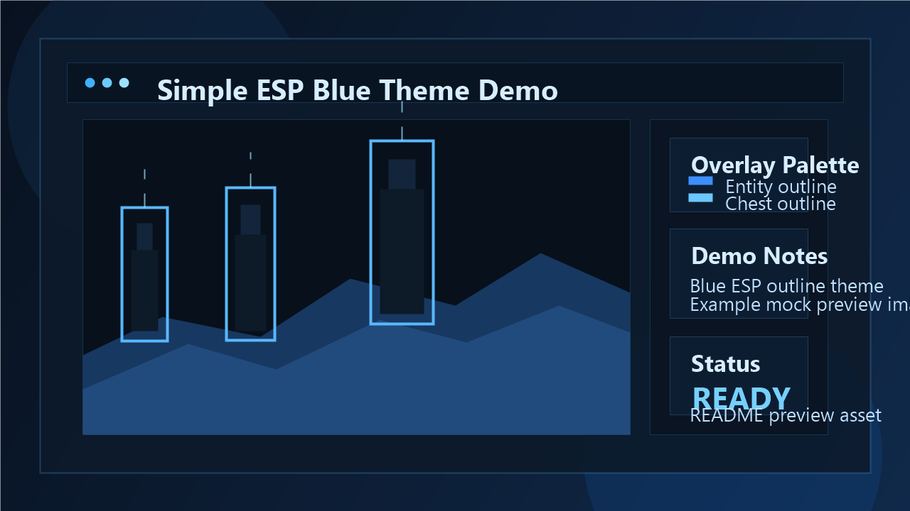

# Simple-ESP

A compact open-source example showing how ESP-style outlines can be rendered for Java Minecraft (1.0 to 1.12.2) by intercepting a small set of OpenGL calls.



## Demo Preview

The image above is an illustrative mockup for the repository README. The current codebase uses a blue overlay theme for entity and chest outlines.

Special thanks to [zayats80888][zayats80888-link], who gave me a lot of useful knowledge about OpenGL, was always patient with my possibly stupid questions and made invaluable contributions to the project. And also [Jacquelin Potier][jackquelin-site-link], for developing the wonderful [WinAPIOverride][jackquelin-program-link] program, which i used for monitoring OpenGL function calls. And of course [Tsuda Kageyu][tsuda-link], whose [project][tsuda-project-link] is used to intercept function calls.

### Explanation
The Java version of the Minecraft game uses OpenGL to draw graphics. We cannot determine exactly which object is currently being drawn, nor can we get its in-game coordinates, since the game does not report this information to the library. However, we can indirectly determine that this is exactly the object that we need based on some signs.

For example:
```cpp
// This part of the code is called every time before drawing the player
protected void preRenderCallback(AbstractClientPlayer entitylivingbaseIn, float partialTickTime)
{
    float f = 0.9375F;
    GlStateManager.scale(f, f, f);
}
As a result, the function call will look like this:

java

glScalef(0.9375F, 0.9375F, 0.9375F);
By intercepting the glScalef function and comparing all three parameters in it with those written above, we can assume that the game is currently going to render the player.

cpp

void WINAPI hk_glScalef(float x, float y, float z)
{
    if (x == 0.9375f and y == 0.9375f and z == 0.9375f)
    {
        // Your code here
    }

    // Calling the original function
    fn_glScalef(x, y, z);
}
Now we can draw something right inside the condition or save the data of the GL_MODELVIEW_MATRIX and GL_PROJECTION_MATRIX matrixes for later use.

Function names, as well as unique parameters, can be obtained by viewing the decompiled game code or by monitoring OpenGL function calls using specialized tools.

Current Theme
Blue-tinted ESP outlines for detected entities and containers.
Lightweight DLL project structure using OpenGL interception plus MinHook.
Local README preview asset included in assets/demo-preview.png.
Compilation
Clone this repository.
Open the simple-esp solution file in Visual Studio IDE.
Select the target platform.
Press ctrl + shift + b to compile.
Usage
Open any DLL-injector as administrator.
Find the java minecraft process.
Inject the simple-esp.dll into process.
Before use, we strongly recommend that you read the license.